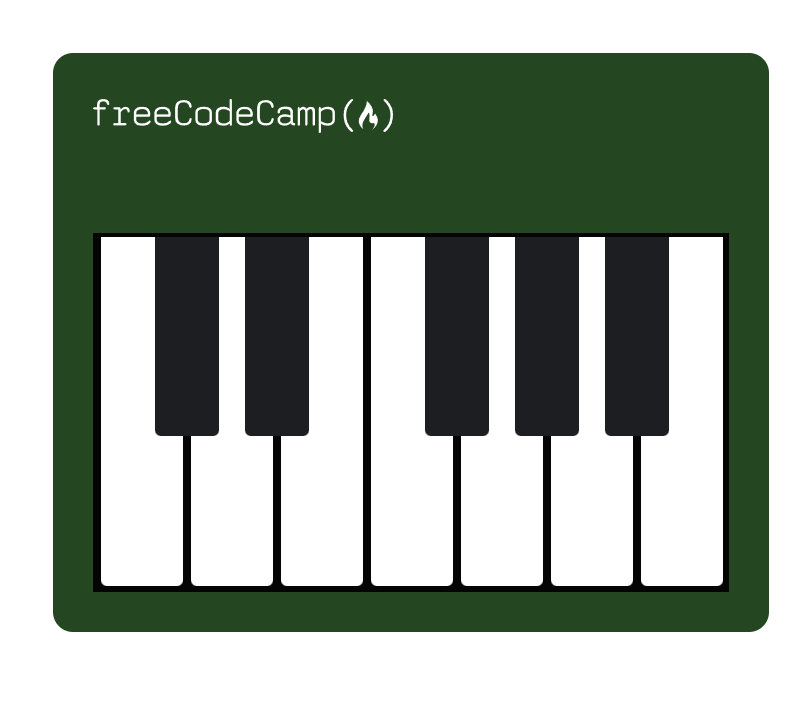

# 🎹 CSS Piano  

## 📌 Description  
**CSS Piano** is a project that creates a piano keyboard using **HTML & CSS**, without relying on JavaScript. This project is ideal for learning and understanding:  

- **Element positioning with CSS**  
- **Using pseudo-elements (`::after`)** to style the black keys  
- **Media queries (`@media`)** to make the piano responsive  

This project is an excellent exercise for beginners in **advanced CSS** and **responsive layout design**.  

---

## 🛠️ Technologies Used  
- **HTML5**: Structure of the page  
- **CSS3**: Layout and styles  

---

## 📂 Project Structure  

```
/css-piano
│── index.html
│── styles.css
└── README.md
```

### 📜 Files  
1️⃣ **index.html**: Contains the HTML structure of the piano  
2️⃣ **styles.css**: Contains the CSS styles to display the piano  

---

## 🚀 Installation and Execution  

### 1️⃣ Clone the project  
```sh
git clone https://github.com/your-profile/css-piano.git
cd css-piano
```

### 2️⃣ Open the file  
- Open **index.html** in a browser to see the result.  

---

## 🎯 Features  

- 🎼 **Creating a piano keyboard using only HTML & CSS**  
- 🎨 **Advanced use of `div` elements and CSS pseudo-elements**  
- 📱 **Responsive design using media queries**  
- 🎹 **White and black keys aligned to resemble a real piano**  

---

## 📌 Project Preview  

  

---

## 🔗 Example Code  

**HTML:**  
```html
<div id="piano">
  
  <div class="keys">
    <div class="key"></div>
    <div class="key black--key"></div>
    <div class="key black--key"></div>
    <div class="key"></div>
  </div>
</div>
```

**CSS:**  
```css
#piano {
  background-color: #00471b;
  width: 992px;
  height: 290px;
  margin: 80px auto;
  padding: 90px 20px 0 20px;
  position: relative;
  border-radius: 10px;
}
.key {
  background-color: #ffffff;
  position: relative;
  width: 41px;
  height: 175px;
  margin: 2px;
  float: left;
  border-radius: 0 0 3px 3px;
}
.key.black--key::after {
  background-color: #1d1e22;
  content: "";
  position: absolute;
  left: -18px;
  width: 32px;
  height: 100px;
  border-radius: 0 0 3px 3px;
}
```

---

## 📈 Possible Improvements  

- **Add CSS animations** to simulate key pressing  
- **Integrate JavaScript** to play sounds when the keys are clicked  
- **Create a version with customizable colors**  

---

## 📝 Author  

📝 **Gabriel Ralph Christian**  
Developer passionate about programming, artificial intelligence, and web development.  

---

## 📜 License  

📜 This project is licensed under the **MIT License** – feel free to use, modify, and share it.
